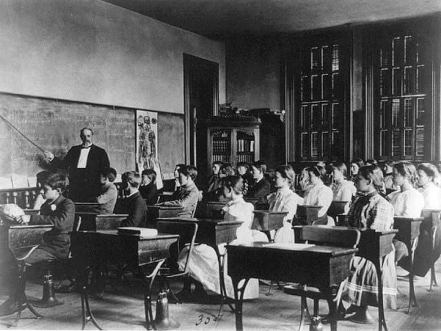
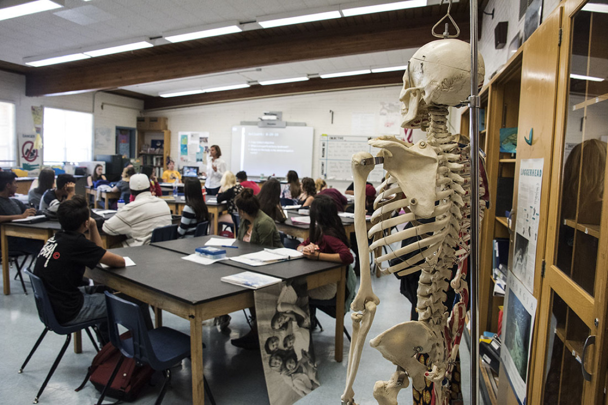

slidenumbers: true
autoscale: true
[.footer: [educomp]: 2019-10-15, Yizhen Huang]

### *Education on the Horizon: Teaching and Learning with Technology*
## Week 1: Introduction
===
#### Dr. Yizhen (Eejain) Huang
###### Department Erziehungswissenschaft, University of Potsdam

----
## First, some house cleaning...
- Course site: https://edutech.netlify.com/
- Course communication: https://discord.gg/e3VpXtv
- Syllabus  

---
## A walk thourgh of the tools
- Website
- Discord

---
## Next, let's get to know each other

- Beijing, China: 
    -  Department of Psychology, Beijing Normal University
- Ann Arbor, Michigan, USA: 
    - Combined Program in Education and Psychology, University of Michigan
    - Dual Master in Statistics, University of Michigan
- Potsdam, Brandenburg, Germany

---
## Inside Academia

#### Research interest: visual cognition and learning/teaching

 
 

---

## Inside Academia
#### Data analysis and visualization for learning analytics
 

---
## Outside Academia
- Freelance illustrator and photographer

 

---
## Classroom: old and new

^ washington dc 1890s

---
## Anything changed?

