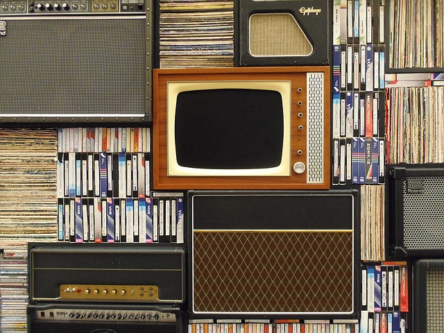
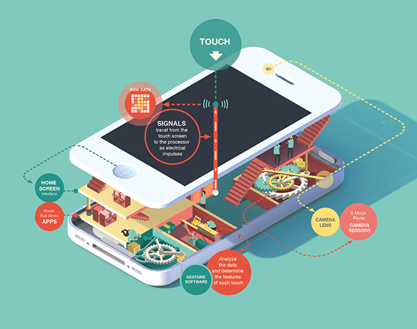
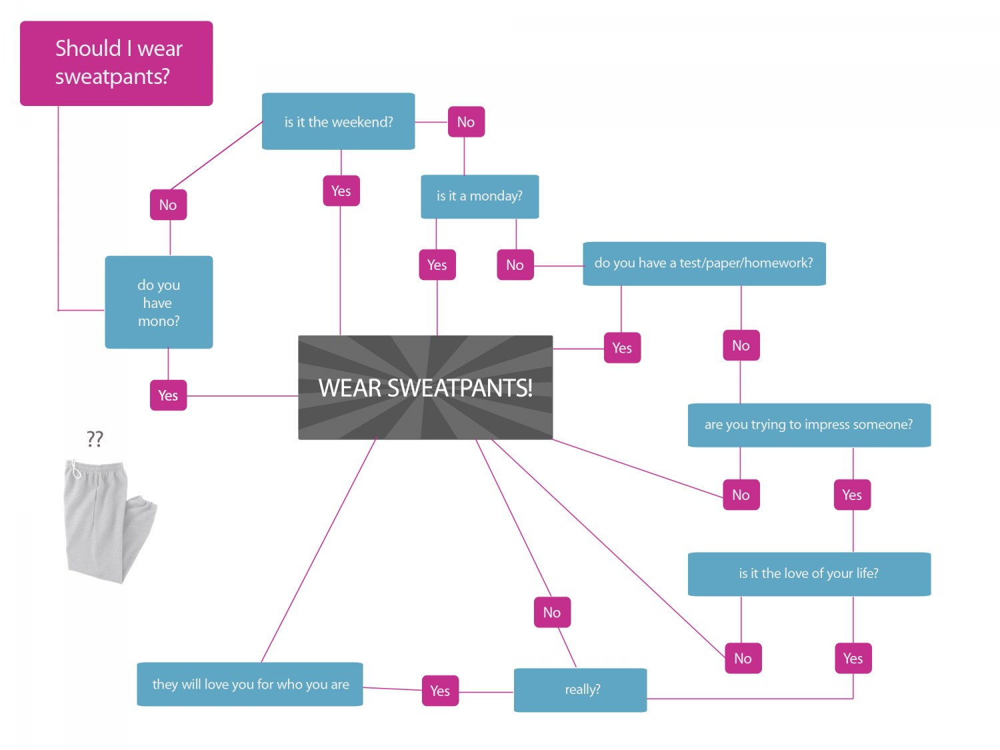

slidenumbers: true
autoscale: true
[.footer: [educomp]: 2019-10-24, Yizhen Huang]

### *Education on the Horizon: Teaching and Learning with Technology*
## Week 2: Multimedia Learning
===
#### Dr. Yizhen (Eejain) Huang
###### Department Erziehungswissenschaft, University of Potsdam

----
## First, some house cleaning...
- [Course site](https://edutech.netlify.com/)
- [Course communication channel](https://discord.gg/e3VpXtv)
- [Sigh up for presentation topic before this Friday](https://docs.google.com/spreadsheets/d/10bdOmFw7KLevjp87eB_meW_1oUtAbdOr_x0cDjChPA4/edit?usp=sharing)

---
## Any questions about the tools?
- Website
- Discord

---
## What is media?
- Media are tools used to store and deliver information or data
- Multimedia are communications that incorporate multiple forms of information content and processing

---
# Medium is like the *vehicle* of information. 

---
## You can convey similar content with different media.

---
## What is multimedia learning
- Present the material using various media types that are intended to foster learning.
- Types of media: text, audio, static graphic (photos, drawings, maps, charts, figures), dynamic graphic (video, animation)

---
## Why is it an attractive idea?

- Suitability: sometimes one media is more suitable to present certain information than others
- Student preference: sometimes one prefer certain media than others

---
## Let's consider suitability first...

---
## Visual over words? 

---
## Example 1. How would you explain how a smart phone works?

---

---
## Example 2. How do you decide what to wear?

---

---
## Visual over words
- When the concept is abstract and hard to visualize.
- When the logic is not linear.

---
## Audio over visual?
- Audio carries unique information
      + Example: [Hearning range test (6:25-10:00)](https://www.20k.org/episodes/hearingloss )

---
## What about personal preferences for media types?

---
## Is the "learning style" theory true?
- Claims of the learning style theory:
      + Each person has a preferred way of receiving new information: visual, auditory, kinesthetic
      + When learning something new, student will learn better when the instruction matches their preferred media types
+ Are these claims true?

---
## Example of instruction according to learning style theory
- When learning addition...
      - Visual learner: view grouping of objects
      - Auditory learner: listen to sets of rhythms
      - Kinesthetic learner: arrange objects into groups

---
## What's wrong with this approach?
- No matter what's the input module, most of the information are encoded semantically (as meaning)
- Everyone can benefit from various representations of the same content

---
## Take home message
- We need to consider which media to use for instruction, because 
      - sometimes one media is more suitable to present certain information than others
      - sometimes one prefer certain media than others, although multimedia can be beneficial for everyone

