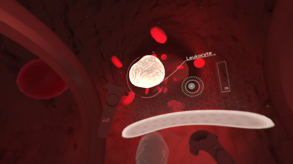
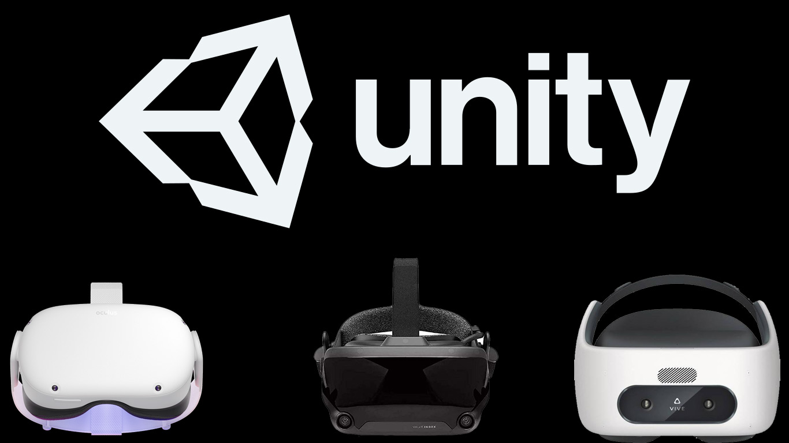
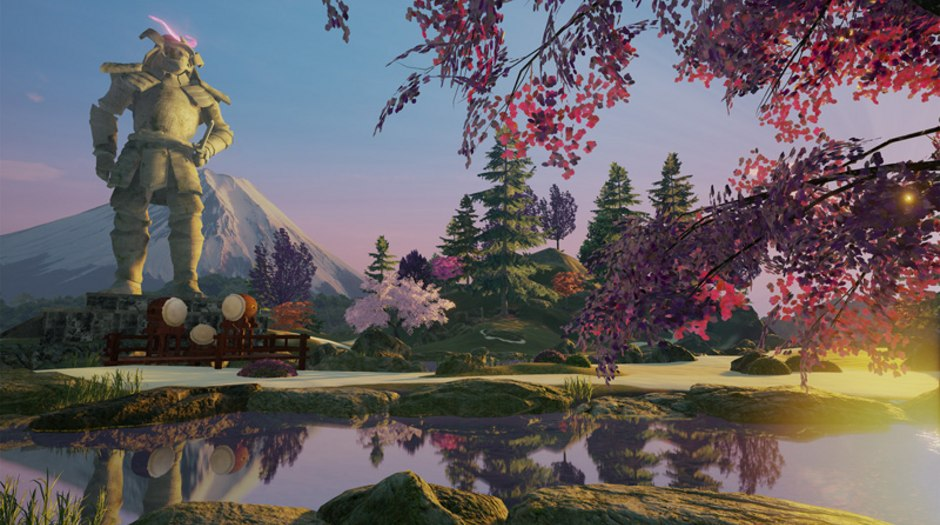
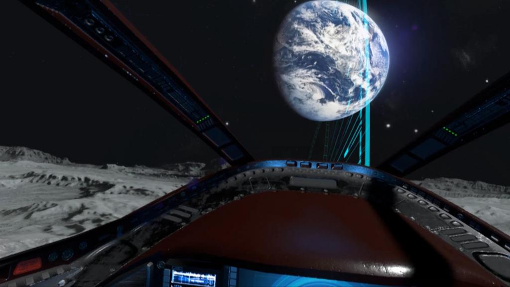
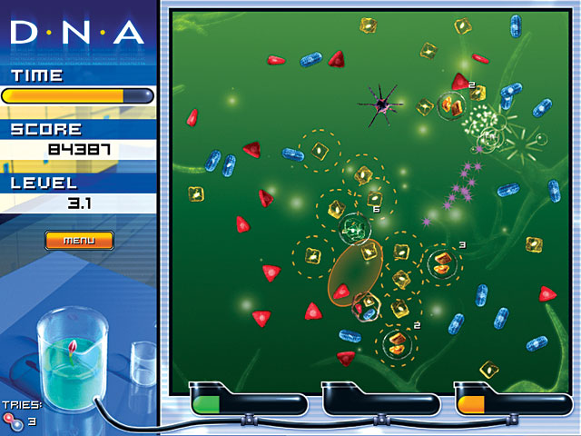
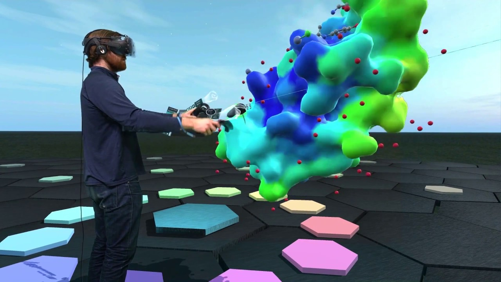
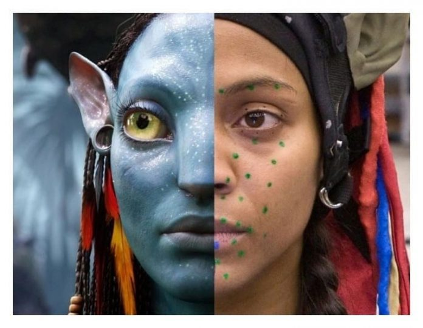
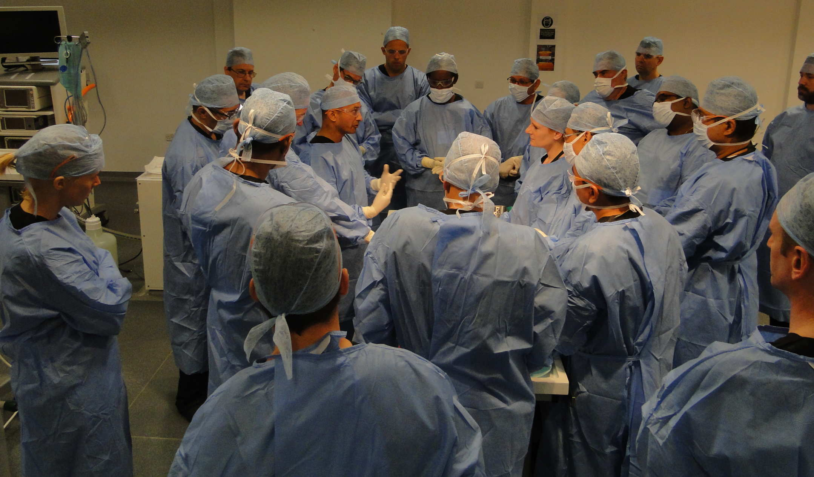
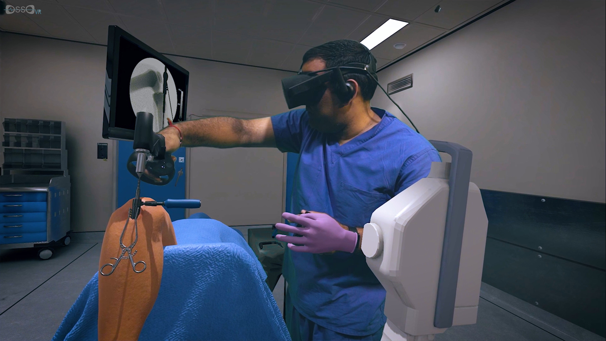

theme: Merriweather (Edited), 5
background-color: #FFFFFF
code: Fira Code Medium, #EE783F, #8B3D90, #2E59A2, #DF393F, #1EA8D9
header: Open Sans Light, alignment(center), #F6F8FF, text-scale(1.2)
header-strong: Open Sans Bold, #C1D3E0
text: Open Sans, #000000, text-scale(0.8)
text-strong: Open Sans Bold, #00315E
footer:  2022-11-17 | The Future of Education – Overcoming Educational Inequality Through Innovation | University of Potsdam | ©  Yizhen (Eejain) Huang 	            
footer-style: Open Sans Light, alignment(left), #F6F8FF, text-scale(2)
slidenumbers: true
slidenumber-style:  Open Sans Light, #F6F8FF, alignment(right)
slidecount: true
autoscale: true
build-lists: true

[.header: alignment(center), line-height(20), #E2E2E2]
[.text: #000000, alignment(center)]

### Theoretical Aspects of Learning: Virtual Reality Based Learning

  
The **Why** and **How** of VR-based Learning 

---

# VR the technology

VR app → Game Engine → VR head-mounted device (HMD)

 

^ a collection of different technologies. the body vr

---

# VR the experience

- VR is the virtual recreation of the physical reality we live in. 
- VR > Virtuality / Reality

 

^ similar but also different. In VR, you not only experience things possible in real world, such as walking in a nice garden, but also impossible, like flying through a black hole. when done right, it has potential to be more than v/r

---

# VR > Virtuality

 

^ nanome, 

---

---

# VR > Virtuality

- VR experience is "embodied" through the virtual body ("avatar")

---

# VR > Virtuality

- Embodied experience forges stronger memory

 

---

# VR > Reality

 

---

---

# VR > Reality

- Controlled, standardized, individualized environment
- Step-wise training

---
[.header: alignment(center), #00315E]

# What do *you* think VR could be useful for?

---

[.hide-footer]

^ questions from attendants: the general workflow to develop vr pd (public servant, management, medical etc)? will vr pd help to close the income gap in developing countries? the cost of this workflow? any platform that provides hardware + software+ pd material package? (mursion, ai center in michigan https://ai.umich.edu/blog-posts/cai-offering-funding-support-for-xr-teaching-and-learning-experiences-to-u-m-faculty/?utm_medium=Email)
